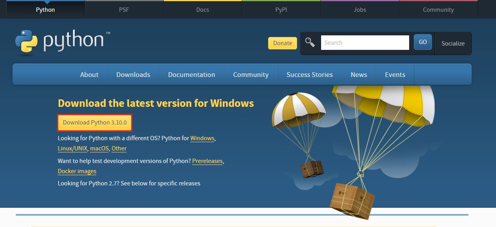
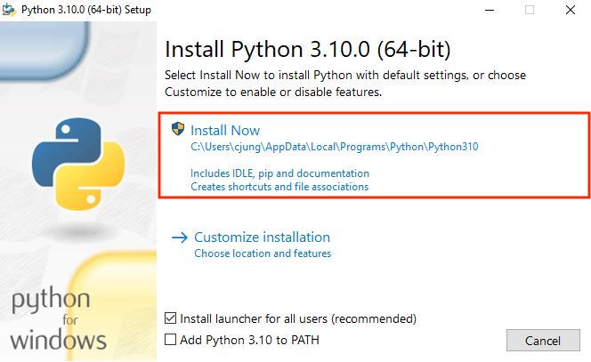
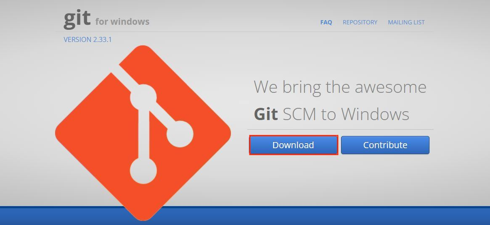
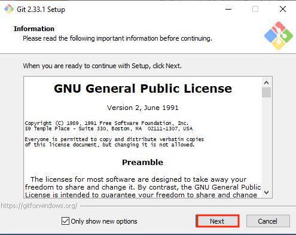
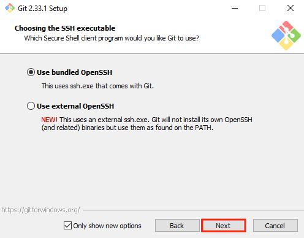
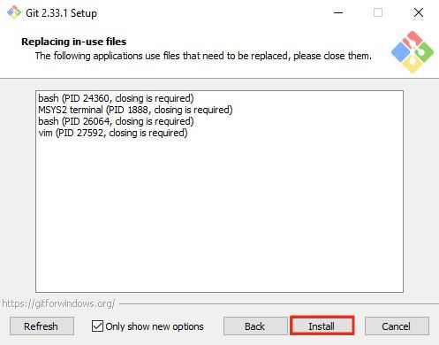

# kinect-sync-vicon
 Sync two Kinects and starts VICON recording

### :warning: If you don't have any version of Python3, please install [Python3](https://www.python.org/downloads/)
* Please visit the link and follow the red boxes below.

### :warning: If you don't have GitBash, please follow these steps, then continue for Environment Setup:
* [GitBash](https://gitforwindows.org/)
* Please visit the link and follow the red boxes below.

