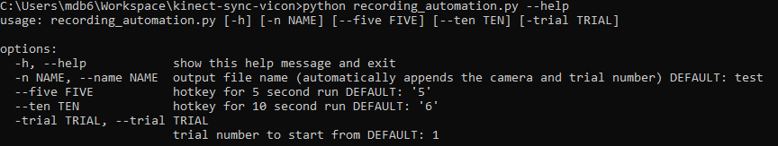

# kinect-sync-vicon
 Sync two Kinects and starts VICON recording

### Download Python
Check if you have python installed, open Command Prompt and paste the following:

```python --version```

If you see the version number, move on to Download Pip.

#### :warning: If you don't have any version of Python3, please install [Python3](https://www.python.org/downloads/)
* Please visit the link and follow the red boxes below.


### Download Pip
Check if you have pip installed, open Command Prompt and paste the following:

```pip --version```

#### :warning: If you don't have pip, please follow these steps:
Go to this link: https://bootstrap.pypa.io/get-pip.py. Right click and save as to download the file.
Then run the following to install pip:

```python get-pip.py```

If you see the version number, move on to Download Git.

### Download Git
Check if you have Git installed, open Command Prompt and paste the following:

```git --version```

If you see the version number, move on to Download Project.

#### :warning: If you don't have GitBash, please follow these steps, then continue for Environment Setup:
* [GitBash](https://gitforwindows.org/)
* Please visit the link and follow the red boxes below.


### Download Project

```git clone https://github.com/boyle-michael/kinect-sync-vicon```

```cd kinect-sync-vicon```

### Install Packages

```pip install pynput```

```pip install pyautogui```

### Run the program
First run this to see the argument options:

```python recording_automation --help```



All of the arguments are optional. However, it is recommened that you specify the base for the output file name. 

Now run the program with your desired arguments: 

```python recording_automation -n testFileName```

The first thing it will ask is for you to mouse the mouse to the location of the start button. In the VICON software, this will be on a panel on the righthand side of the screen. Once the mouse is over the start button, press Crtl + c to save that mouse location. 


Finally, follow the directions to start trials. You can change the hotkeys that start the trials by specifying them in the program arguments. For example, the following will change the 5 second trial to start with '-' and the 10 second trial to start with '='.

